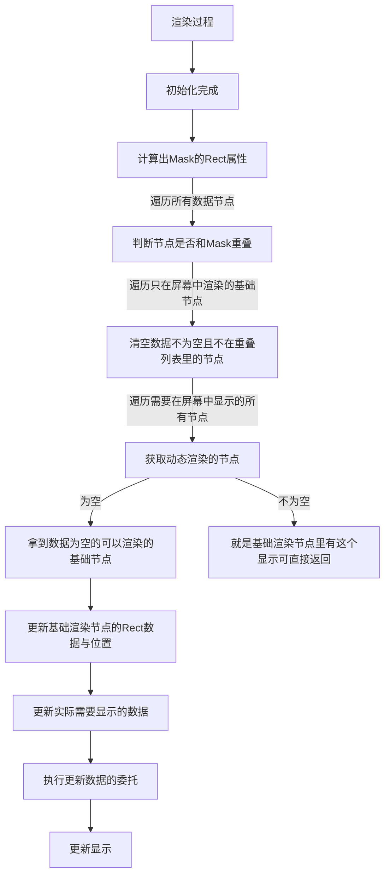

```mermaid
graph TB
id1[渲染过程]
id2[初始化完成]
id3[计算出Mask的Rect属性]
id4[判断节点是否和Mask重叠]
id1-->id2-->id3--遍历所有数据节点-->id4

id4--遍历只在屏幕中渲染的基础节点-->id5
id5[清空数据不为空且不在重叠列表里的节点]
id5--遍历需要在屏幕中显示的所有节点-->id6
id6["获取动态渲染的节点"]

id6--为空-->id7
id6--不为空-->就是基础渲染节点里有这个显示可直接返回
id7["拿到数据为空的可以渲染的基础节点"] -->更新基础渲染节点的Rect数据与位置-->更新实际需要显示的数据-->
执行更新数据的委托-->更新显示
```

